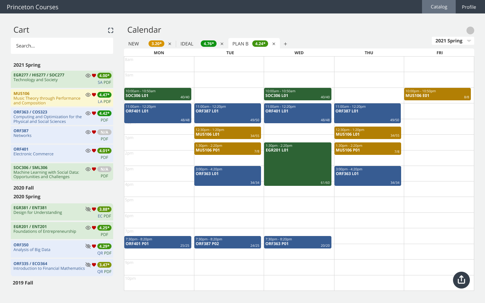

<header>
  <h1>Tigerbook</h1>
  

    Tigerbook is a directory application that allows students to learn more about and to connect with their peers. Tigerbook has stored student information like hometowns, roommates, and dorm room numbers, enabling students to find shared backgrounds and locate one another to drop off care packages. However, in September 2019 a major privacy update where most student information was removed was implemented after many students expressed privacy concerns. With only student names and photos left, Tigerbook lost most of its value as a student resource for social connection, so ResInDe came in with the goal of restoring its initial value while also addressing student concerns. As much of what made Tigerbook so useful was the information it contained, the now bare-bone version of Tigerbook has lost much of its value among students. Our goal was understanding how we can bring back the value to the application. 
  

</header>

  

    

      <h4>Team</h4>
      <ul>
        <li>Ameya Vaidya '24</li>
        <li>Manasseh Alexander '21</li>
        <li>Sophie Torres '21</li>
        <li>Ashley To '22</li>
      <ul>
    

    

      <h4>Collaborators</h4>
      <ul>
        <li>TigerApps</li>
      <ul>
    

  

  

    

      <h4>Tools</h4>
      <ul>
        <li>Figma</li>
      <ul>
    

    

      <h4>Methods</h4>
      <ul>
        <li>User Interviews</li>
        <li>User Testing</li>
        <li>Surveys</li>
        <li>Affinity Mapping</li>
        <li>User Journey Mapping</li>
        <li>Feasibility vs. Priority Graph</li>
        <li>User Personas</li>
      <ul>
    

  

  

    

      <h4>Timeline</h4>
      
October 2020 - Present

    

  

<section class="problem">
  <h2>Problem</h2>
  <h3 style="max-width: 850px">How might we provide engaging information & capabilities while balancing privacy concerns?</h3>
</section>

<section class="solution">
  <h2>Solution</h2>
  <h3>Reflecting themes of reliability and connectivity.</h3>
  

    

      Our solution to restore Tigerbook’s core value of allowing students to build and foster connection was to provide student information under an opt-in condition. We also focused on creating a welcoming user experience to reflect its themes of reliability and connectivity.
    

  

</section>

<figure class="featured-img">
  
</figure>

<section class="research">
  <h2>Research</h2>
  <h3>Putting faces to names.</h3>
  

    <figure>
      
    </figure>
    <figure>
      
    </figure>
    <figure>
      
    </figure>
  

  

    

      In our initial phase, we conducted 8 user interviews and spoke with students about their experience. We jotted down notes and after all the interviews, hopped on a call to organize them: first, each member walked the teammates through their interviews and the findings from it. Then, we began grouping notes together and developed themes. Finally, we placed the points onto a user journey map to contextualize the notes.
    

    

      The top use cases by students were:
      <ul>
        <li>Include more Princeton-specific information as engagementn</li>
        <li>Incorporate Opt-in/Opt-out capabilities to balance varying privacy concerns</li>
        <li>An updated design</li>
      </ul>
    

  

</section>

<section class="ideation">
  <h2>Ideation</h2>
  <h3 style="max-width: 700px">Not a social network, but a student resource.</h3>
  

    <figure>
      
    </figure>
    <figure>
      
    </figure>
  

  

    

      We ideated different approaches from a social media approach with friends-only profile visibility to adding interest outside of academics. Each idea had their pros and cons, but we ultimately decided to approach the major use case of Tigerbook as a student resource. This helped shape the pathway we wanted by avoiding the exclusive nature of the social media, friend-reliant idea and remaining centralized on Princeton-specific interests.
    

  

</section>

<section class="prototypes">
  <h2>Prototypes</h2>
  <h3>Getting the details right.</h3>
  

    <figure>
      
    </figure>
    <figure>
      
    </figure>
    <figure>
      
    </figure>
  

  

    

      We open the app with a straightforward form that users can easily fill out with information that they’d like to have shown on their profile. No information is "required" to be filled out as the minimum necessary information is provided by default as it is in the current app (class year, major, ID, photo).
    

    

      Another major change was addressing the search capabilities to incorporate the new information. This search bar in our design includes multiple filters to search by and is easily accessible on the side in the search results.
    

    

      How the profile is displayed was also a major design feature. Our design mimics a “prox” which is the student ID card and contains all the default information. As users add more information, the information will appear underneath the card in categories.
    

    

      We also updated the design of the app to feel welcoming and modern – emulating the new approach. Our team member, Sophie Torres ‘21, designed the new logo for Tigerbook!
    

  

</section>

<section class="reflection">
  <h2>Reflection</h2>
  <h3>A seemingly simple problem can have many solutions and approaches.</h3>
  

    

      Talking to users and conducting surveys really helped verify our ideas and avoid making assumptions about our users!
    

  

</section>

  More of our work ->

